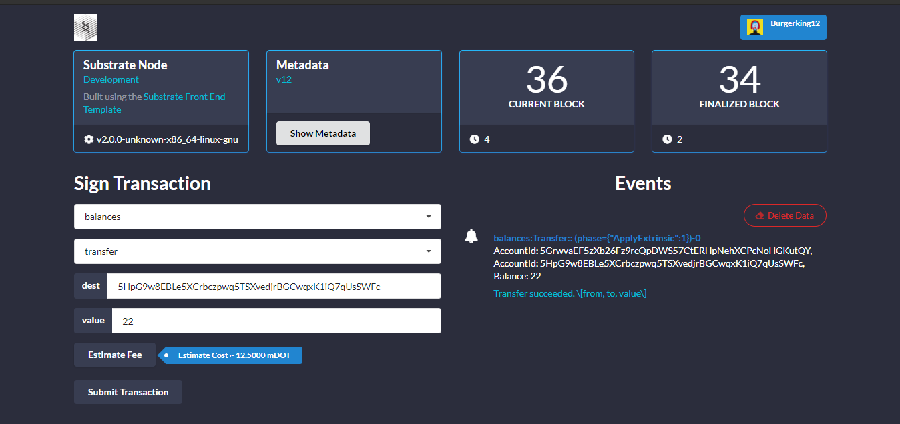

## Make sure ran Substrate ApiSidecar && Substrate Node Localy
```bash
$ cd substrate-api-sidecar
$ yarn start
```
```bash
$ cd substrate-node-template
$ ./target/release/node-template --dev 
```
- [x] <p align="center">
    <a>
        
    </a>
    </p>

